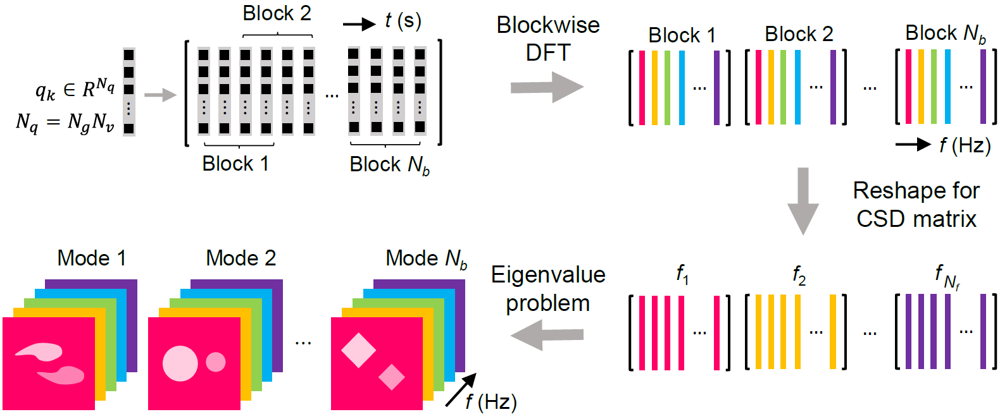
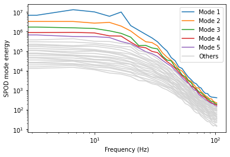
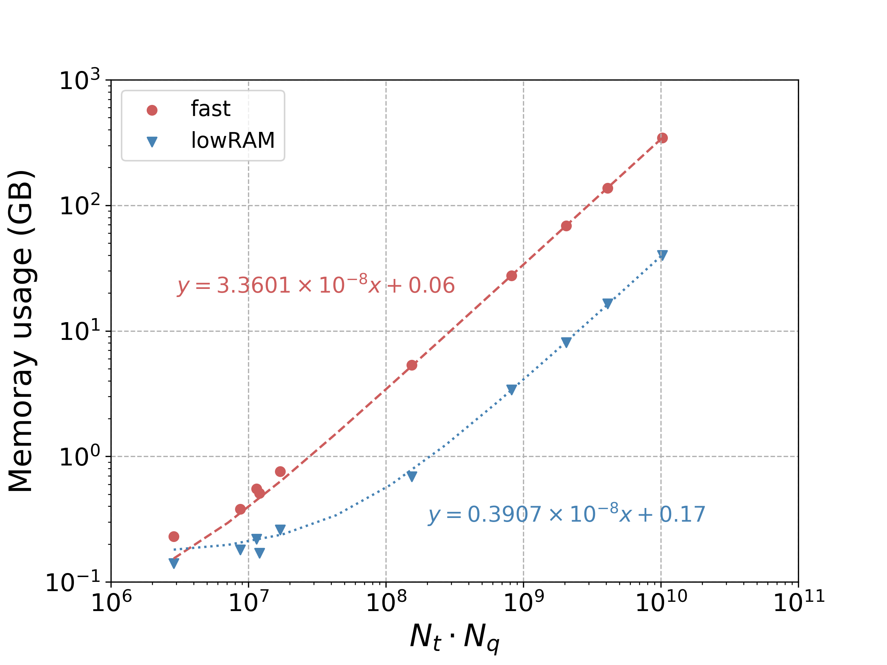

<p align="center">
    
</p>

---

# Spectral Proper Orthogonal Decomposition in Python

Spectral Proper Orthogonal Decomposition (SPOD) decomposes the space-time dataset into mutually orthogonal modes. Each mode oscillates at a single frequency and is ranked by the energy level. The SPOD workflow is illustrated in the following figure. For a detailed understanding of SPOD, the readers are redirected to: (1) SPOD theory [[1](#theory)]; (2) SPOD algorithm [[2](#algorithm)]; (3) SPOD reconstruction [[3](#reconstruction)]; (4) SPOD applications [[4](#application)].

<p align="center">
    
</p>

This repository contains a Pythonic realization of SPOD and its applications to a range of fluid mechanics problems. If this script appears useful for your research, an explicit mention of the work [[5](#ddes-spod)] would be highly appreciated.

## Quick Start

### Step 1: Download package
#### Download from Git clone in the terminal

git clone [https://github.com/HexFluid/spod_python.git](https://github.com/HexFluid/spod_python.git)

#### Download from browser

Download from this [link](https://github.com/HexFluid/spod_python/archive/master.zip) and then unzip it.

### Step 2: Install prerequisites
Launch a terminal (UNIX) or an Anaconda Prompt (Windows) window and change directory to *spod_python*. Run the following command line to install/upgrade the prerequisite Python packages.

```
pip install -r requirements.txt
```

### Step 3: Load example data
Run the following script with Python 3 to load the data:
```python
import h5py
import os

current_path = os.getcwd() # assuming Python launched in the 'spod_python' dir
data_path    = os.path.join(current_path,'tutorials','bstep_data','bstepDDES.h5')

h5f  = h5py.File(data_path,'r')
data = h5f['data'][:]        # flow field data
dt   = h5f['dt'][0]          # unit in seconds
h5f.close()
```

### Step 4: Run SPOD
Run the following script to obtain SPOD results:
```python
import spod

spod.spod(data,dt,current_path,weight='default',nOvlp='default',window='default',method='fast')

SPOD_LPf  = h5py.File(os.path.join(current_path,'SPOD_LPf.h5'),'r') # load data from h5 format
L = SPOD_LPf['L'][:,:]    # modal energy E(f, M)
P = SPOD_LPf['P'][:,:,:]  # mode shape
f = SPOD_LPf['f'][:]      # frequency
SPOD_LPf.close()
```

### Step 5: Postprocess
Finally, run the following script to visualize the SPOD spectrum:
```python
fig = spod.plot_spectrum(f,L,hl_idx=5)
```

Expected results:
<p align="left">
    
</p>

For more postprocess tutorials including plotting mode shapes and reconstructed flow fields, please refer to the scripts with detailed comments in [tutorials](./tutorials/README.md).


## Memory Usage
SPOD is a memory-demanding algorithm. Before running it on your own case, please check if the memory requirement has been met. The figure below helps estimate the memory usage of new cases. All data are provided in the [table](./docs/tabs/memory_usage.csv) and are obtained by running *spod.spod* using default parameters.

<figure>
<p align="left">
    
    <figcaption align="left"> Nt: number of snapshots; Nq: number of data per snapshot </figcaption>
</p>
</figure>

For fluid mechanics applications, the problem size can be reduced by selecting data every few grid points and time steps. This approach degrades the resolution in small scales but preserves that in the large scales. It is the large scales that are of interest to SPOD.

A more memory-efficient SPOD algorithm named streaming SPOD [[2](#algorithm)] will be implemented in this package in later versions.

## List of Files

<pre>
.
|-- docs
|   |-- figs
|   |-- tabs
|-- tutorials
|   |-- bstep_data
|   |   |-- singlevar_results
|   |   |-- multivar_results
|   |   |-- bstepDDES.h5
|   |-- comp_data
|   |   |-- singlevar_results
|   |   |-- compDDES.h5
|   |-- cooling_data
|   |   |-- multivar_results
|   |   |-- coolingDDES.h5
|   |-- jet_data
|   |   |-- singlevar_results
|   |   |-- jetLES.h5
|   |-- 00_jet_single_var.py
|   |-- 01_bstep_single_var.py
|   |-- 02_bstep_multi_var.py
|   |-- 03_comp_single_var.py
|   |-- 04_cooling_multi_var.py
|-- LICENSE
|-- requirements.txt
|-- spod.py
</pre>

- **spod.py**: main script of spod_python
- **requirements.txt**: a list of prerequisite Python libraries
- **LICENSE**: license file
- **tutorials**
  - **bstep_data**
    - **singlevar_results**: postprocess results of the single variable case
    - **multivar_results**: postprocess results of the multiple variable case
    - **bstepDDES.h5**: flow field and grid data (HDF5 format)
  - **comp_data**
    - **singlevar_results**: postprocess results of the single variable case
    - **compDDES.h5**: pressure and grid data of a compressor rotor blade (HDF5 format)
  - **cooling_data**
    - **multivar_results**: postprocess results of the multiple variable case
    - **coolingDDES.h5**: flow field and grid data (HDF5 format)
  - **jet_data**
    - **singlevar_results**: postprocess results of the single variable case
    - **jetLES.h5**: flow field and grid data (HDF5 format)
  - **00_jet_single_var.py**: tutorial script for single variable SPOD of the jet case
  - **01_bstep_single_var.py**: tutorial script for single variable SPOD of the backward-facing step case
  - **02_bstep_multi_var.py**: tutorial script for multiple variable SPOD of the backward-facing step case
  - **03_comp_single_var.py**: tutorial script for single variable SPOD of the compressor rotor blade case
  - **04_cooling_multi_var.py**: tutorial script for multiple variable SPOD of the film cooling case
- **docs**
  - **figs**: figures appeared in the markdown files
  - **tabs**: tables of spod_python performance data

## References
[<a id="theory">1</a>] Towne, A., Schmidt, O. T., & Colonius, T. (2018). Spectral proper orthogonal decomposition and its relationship to dynamic mode decomposition and resolvent analysis. Journal of Fluid Mechanics, 847, 821-867. [[DOI](https://doi.org/10.1017/jfm.2018.283)]

[<a id="algorithm">2</a>] Schmidt, O. T., & Towne, A. (2019). An efficient streaming algorithm for spectral proper orthogonal decomposition. Computer Physics Communications, 237, 98-109. [[DOI](https://doi.org/10.1016/j.cpc.2018.11.009)]

[<a id="reconstruction">3</a>] Nekkanti, A., & Schmidt, O. (2021). Frequency–time analysis, low-rank reconstruction and denoising of turbulent flows using SPOD. Journal of Fluid Mechanics, 926, A26. [[DOI](https://doi.org/10.1017/jfm.2021.681)]

[<a id="application">4</a>] Schmidt, O. T., & Colonius, T. (2020). Guide to spectral proper orthogonal decomposition. AIAA Journal, 58(3), 1023-1033. [[DOI](https://doi.org/10.2514/1.J058809)]

[<a id="ddes-spod">5</a>] He, X., Fang, Z., Rigas, G. & Vahdati, M., (2021). Spectral proper orthogonal decomposition of compressor tip leakage flow. Physics of Fluids, 33(10), 105105. [[DOI](https://doi.org/10.1063/5.0065929)][[preprint](https://www.researchgate.net/publication/344903736_Spectral_Proper_Orthogonal_Decomposition_of_Compressor_Tip_Leakage_Flow)]
