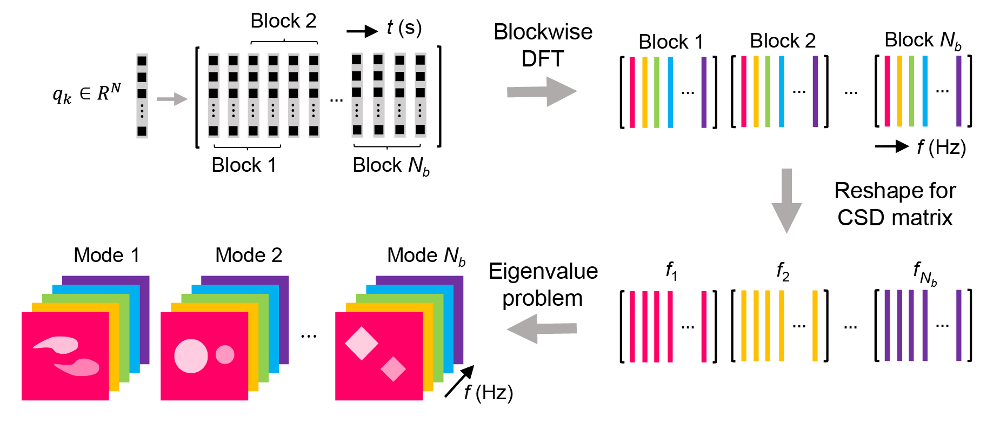

# Spectral Proper Orthogonal Decomposition in Python

Spectral Proper Orthogonal Decomposition (SPOD) decomposes the space-time dataset into mutually orthogonal modes. Each mode oscillates at a single frequency and is ranked by the energy level. This repository contains a Pythonic realization of SPOD and its applications to a range of fluid mechanics problems.

The SPOD toolkit in this repository was originally written for analyzing compressor tip leakage flows [[1](#ddes-spod)], which is included as one of the example cases. Other example cases include a backward-facing step flow [[2](#ddes-method)] and a jet flow [[3](#jet)]. If this script appears useful for your research, an explicit mention of the work [[1](#ddes-spod)] would be highly appreciated. If you are using any data from the example cases, please refer to the corresponding publications mentioned above.

The SPOD workflow is illustrated in the following figure. For a detailed understanding of SPOD, the readers are redirected to: (1) SPOD theory [[4](#theory)]; (2) SPOD algorithm [[5](#algorithm)]; (3) SPOD applications [[6](#application)].

<p align="center">
    
</p>


## Quick Start

### Step 1: Download package
#### Download from Git clone in the terminal

git clone [https://github.com/HexFluid/spod_python.git](https://github.com/HexFluid/spod_python.git)

#### Download from browser

Download from this [link](https://github.com/HexFluid/spod_python/archive/master.zip) and then unzip it.

### Step 2: Install prerequisites
Launch a terminal (UNIX) or an Anaconda Prompt (Windows) window and change directory to *spod_python*. Run the following command line to install/upgrade the prerequisite Python packages.

```
pip install -r requirements.txt
```

### Step 3: Load example data
Run the following script with Python 3 to load the data:
```python
import h5py
import os

current_path = os.getcwd() # assuming Python lauched in the 'spod_python' dir
data_path    = os.path.join(current_path,'examples','bstep_data','bstepDDES.h5')

h5f  = h5py.File(data_path,'r')
data = h5f['data'][:]        # flow field data
dt   = h5f['dt'][0]          # unit in seconds
h5f.close()
```

### Step 4: Run SPOD
Run the following script to obtain SPOD results:
```python
import spod

[L,P,f] = spod.spod(data,dt,weight='default',nOvlp='default',window='default')
```

### Step 5: Postprocess
Finally, run the following script to visualize the SPOD spectrum:
```python
fig = spod.plot_spectrum(f,L,hl_idx=5)
```

Expected results:
<p align="left">
    
</p>

For more detailed postprocess examples including plotting mode shapes and flow field reconstructions, please refer to the [examples](./examples/).


## Memory Usage
SPOD is a memory-demanding algorithm. Before running it on your own case, please check if the memory requirement has been met. The table below helps estimate the memory usage of new cases. All data are obtained by running *spod.spod* in default mode.

| Case | Snapshot count | Data count / snapshot | Memory usage | CPU time |
| :--: | :------------: | :-------------------: | :----------: | :------: |
| #1   | 2500           | 6825                  |  0.77 GB     | 2.5 s    |
| #2   | 800            | 3580                  |  0.29 GB     | 0.4 s    |
| #3   | 800            | 14320                 |  0.56 GB     | 1.6 s    |
| #4   | 1701           | 7086                  |  0.53 GB     | 1.6 s    |
| #5   | 1701           | 36377                 |  2.20 GB     | 8.6 s    |
| #6   | 1701           | 468442                |  26.72 GB    | 877.9 s  |
| #7   | 1701           | 2407465               |  136.87 GB   | 3645.5 s |

For fluid mechanics applications, the problem size can be reduced by selecting data every few grid points and time steps. This approach degrades the resolution in small scales but preserves that in the large scales. It is the large scales that are of interest to SPOD.

A memory-efficient SPOD algorithm named streaming SPOD [[5](#algorithm)] will be implemented in this package in later versions.

## List of Files

<pre>
.
|-- examples
|   |-- bstep_data
|   |   |-- singlevar_results
|   |   |-- multivar_results
|   |   |-- bstepDDES.h5
|   |-- comp_data
|   |   |-- singlevar_results
|   |   |-- compDDES.h5
|   |-- jet_data
|   |   |-- singlevar_results
|   |   |-- jetLES.h5
|   |-- 00_jet_single_var.py
|   |-- 01_bstep_single_var.py
|   |-- 02_bstep_multi_var.py
|   |-- 03_comp_single_var.py
|-- LICENSE
|-- requirements.txt
|-- SPOD_quickstart_result.png
|-- SPOD_schematic.png
|-- spod.py
</pre>

- **spod.py**: main script of spod_python
- **SPOD_schematic.png**: graphical illustration of SPOD algorithm
- **SPOD_quickstart_result.png**: SPOD energy spectrum of the quick start case
- **requirements.txt**: a list of prerequisite Python libraries
- **LICENSE**: license file
- **examples**
  - **bstep_data**
    - **singlevar_results**: postprocess results of the single variable case
    - **multivar_results**: postprocess results of the multiple variable case
    - **bstepDDES.h5**: flow field and grid data (HDF5 format)
  - **comp_data**
    - **singlevar_results**: postprocess results of the single variable case
    - **compDDES.h5**: pressure and grid data of a compressor rotor blade (HDF5 format)
  - **jet_data**
    - **singlevar_results**: postprocess results of the single variable case
    - **jetLES.h5**: flow field and grid data (HDF5 format)
  - **00_jet_single_var.py**: tutorial script for single variable SPOD of the jet case
  - **01_bstep_single_var.py**: tutorial script for single variable SPOD of the backward-facing step case
  - **02_bstep_multi_var.py**: tutorial script for multiple variable SPOD of the backward-facing step case
  - **03_comp_single_var.py**: tutorial script for single variable SPOD of the compressor rotor blade case

## References
[<a id="ddes-spod">1</a>] He, X., Fang, Z., Vahdati, M. & Rigas, G., (2021). Spectral proper orthogonal decomposition of compressor tip leakage flow. ETC Paper No. ETC2021-491. (under review) [[preprint](https://www.researchgate.net/publication/344903736_Spectral_Proper_Orthogonal_Decomposition_of_Compressor_Tip_Leakage_Flow)]

[<a id="ddes-method">2</a>] He, X., Zhao, F., & Vahdati, M. (2021). Detached eddy simulation: recent development and application to compressor tip leakage flow. ASME Paper No. GT2021-59077. (under review) [[preprint](https://www.researchgate.net/publication/347355348_Detached_Eddy_Simulation_Recent_Development_and_Application_to_Compressor_Tip_Leakage_Flow)]

[<a id="jet">3</a>] Brès, G. A., Jordan, P., Jaunet, V., Le Rallic, M., Cavalieri, A. V., Towne, A., Lele, S., Colonius, T., & Schmidt, O. T. (2018). Importance of the nozzle-exit boundary-layer state in subsonic turbulent jets. Journal of Fluid Mechanics, 851, 83-124. [[DOI](https://doi.org/10.1017/jfm.2018.476)]

[<a id="theory">4</a>] Towne, A., Schmidt, O. T., & Colonius, T. (2018). Spectral proper orthogonal decomposition and its relationship to dynamic mode decomposition and resolvent analysis. Journal of Fluid Mechanics, 847, 821-867. [[DOI](https://doi.org/10.1017/jfm.2018.283)]

[<a id="algorithm">5</a>] Schmidt, O. T., & Towne, A. (2019). An efficient streaming algorithm for spectral proper orthogonal decomposition. Computer Physics Communications, 237, 98-109. [[DOI](https://doi.org/10.1016/j.cpc.2018.11.009)]

[<a id="application">6</a>] Schmidt, O. T., & Colonius, T. (2020). Guide to spectral proper orthogonal decomposition. AIAA Journal, 58(3), 1023-1033. [[DOI](https://doi.org/10.2514/1.J058809)]
