## Tutorials

We present four case studies in fluid mechanics using *spod_python*:
- 2D round jet [[1](#jet)]: **00_jet_single_var.py**
- 2D backward-facing step [[2](#ddes-comp)]: **01_bstep_single_var.py**, **02_bstep_multi_var.py**
- 2D compressor blade surface pressure [[2](#ddes-comp)]: **03_comp_single_var.py**
- 2D turbine film cooling [[3](#ddes-cool)]: **04_cooling_multi_var.py**

This page briefly introduces the flow physics of each case, the features of *spod_python* demonstrated in each tutorial script, and the major SPOD results. The tutorial scripts are well-commented, self-explanatory, and easily transferrable to other cases. If you are using any data from the tutorial cases, please explicitly mention the corresponding publications.

---
### Case 1: 2D round jet
The round jet is a fundamental flow case featuring shear-layer instabilities. It is popular in experimental and scale-resolving simulation studies due to its simplicity. The data analyzed in this case is a 2D slice of the full-annulus LES data from Brès et al. [[1](#jet)], which is obtained at a Mach number of 0.9 and a Reynolds number of 30,000. The figures below illustrate the flow schematics and the animation of the unsteady pressure field. (jet center at r/D=0.5)

<figure>

    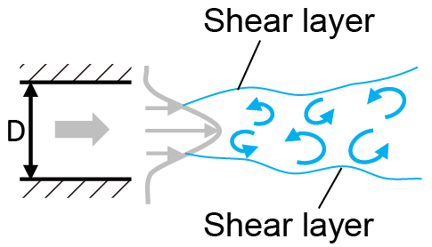
    
    <figcaption align="left"> (left): flow schematics; (right): animation of pressure fluctuation </figcaption>

</figure>

In the tutorial script *00_jet_single_var.py*, the following features of *spod_python* are demonstrated:
- single-variable SPOD in 'fast' mode
- reconstruction of flow field using the time-domain method

The figures below show the expected SPOD mode energy spectrum and the shape of the leading mode in the energy hump region. The results are identical to those obtained using [spod_matlab](https://github.com/SpectralPOD/spod_matlab) and [PySPOD](https://github.com/mengaldo/PySPOD), which verifies the implementation of SPOD in this repository.

<figure>

    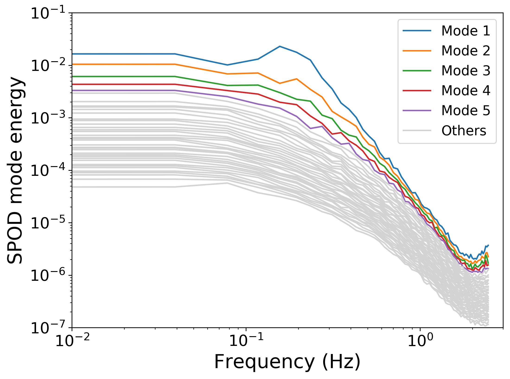
    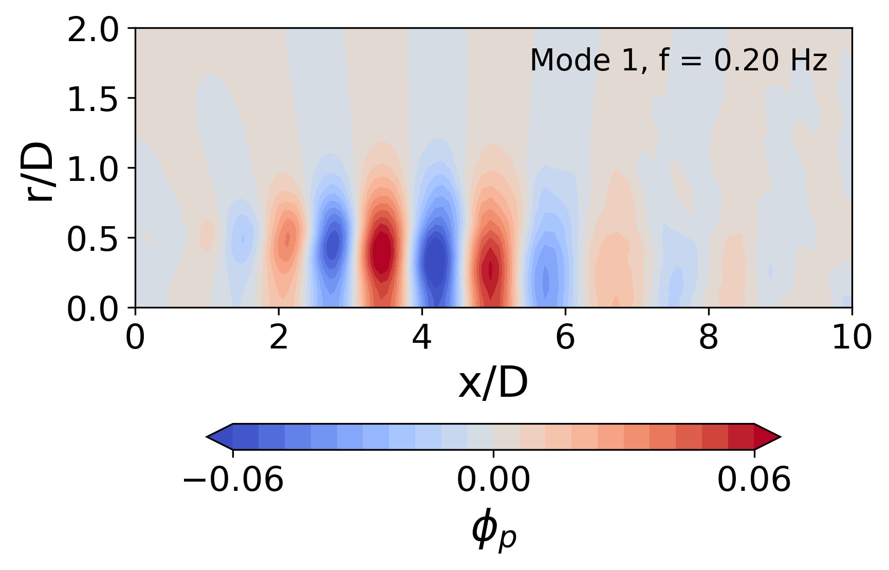
    <figcaption align="left"> (left): SPOD mode energy spectrum; (right): SPOD mode shape </figcaption>

</figure>

---
### Case 2: 2D backward-facing step
The backward-facing step flow is composed of an attached region, a separated region (due to sudden change of geometry) and a re-attached region. It is one of the standard test cases for DES-type methods. The data analyzed in this case is a 2D slice of the coarse-mesh upgraded DDES data from He et al. [[2](#ddes-comp)]. The investigated case has a Mach number of 0.128 and a Reynolds number of 36,000. The figures below illustrate the flow schematics and the animation of the unsteady pressure field. (jet center at r/D=0.5)

<figure>

    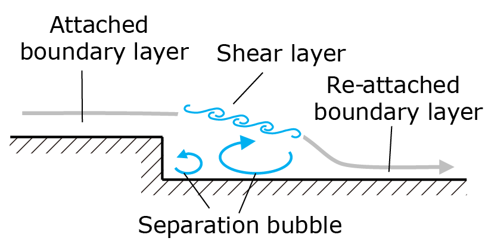
    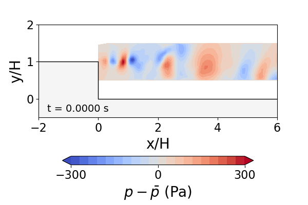
    <figcaption align="left"> (left): flow schematics; (right): animation of pressure fluctuation </figcaption>

</figure>

In the tutorial script *01_bstep_single_var.py*, the following features of *spod_python* are demonstrated:
- single-variable SPOD in 'fast' mode
- reconstruction of flow field using the time-domain method

In the tutorial script *02_bstep_multi_var.py*, the following features of *spod_python* are demonstrated:
- multi-variable (i.e., p, u, v, entropy) SPOD in 'fast' mode
- reconstruction of flow field using the frequency-domain method

The figures below show the expected SPOD mode energy spectrum and the SPOD mode shape from the multi-variable SPOD analysis.

<figure>

    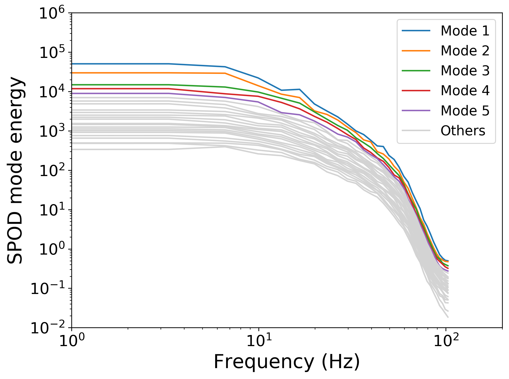
    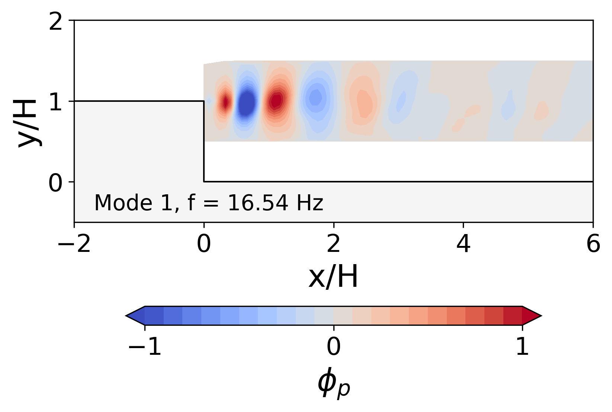
    <figcaption align="left"> (left): SPOD mode energy spectrum; (right): SPOD mode shape </figcaption>

</figure>

---
### Case 3: compressor blade surface pressure
Compressor blade surfaces experience unsteady blade forces due to the impingement and the detachment of the tip leakage vortex. The figures below illustrate the compressor tip leakage vortex and its interaction with the blade surfaces. In this case, the blade surface pressure data of the medium-mesh upgraded DDES data from He et al. [[2](#ddes-comp)] is analyzed using SPOD. The investigated compressor rotor has a tip Mach number of 0.17 and a Reynolds number (based on the tip gap size) of 14,000.

<figure>

    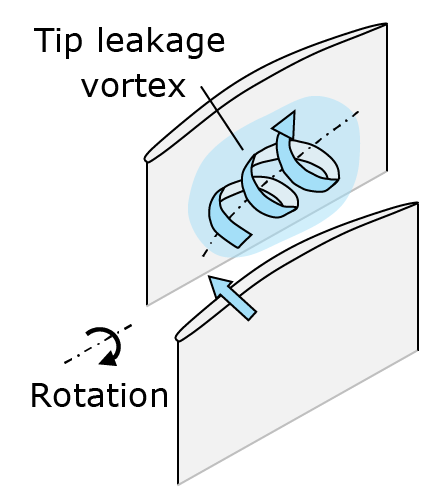
    
    <figcaption align="left"> (left): flow schematics; (right): animation of vortex structures indicated by the iso-surface of Q-criterion </figcaption>

</figure>

In the tutorial script *03_comp_single_var.py*, the following features of *spod_python* are demonstrated:
- single-variable SPOD in 'fast' mode
- reconstruction of flow field using the time-domain method

The expected SPOD mode energy is illustrated in the figure below. An energy spike is captured by Mode 1 at 9.77 BPF, which from its mode shape in the bottom-right figure behaves like a backward-traveling pressure wave. A detailed examination of the flow field showed that the pressure wave is generated by the shock buffeting at the blunt throat of the downstream choked nozzle (not shown). Although this phenomenon is only numerical, it clearly demonstrates the capability of SPOD in identifying different sources of waves (e.g., forward/backward-traveling waves). The data presented in the reference [[2](#ddes-comp)] were obtained with a smooth throat and a sponge zone, and thus the numerical spike did not appear.

<figure>

    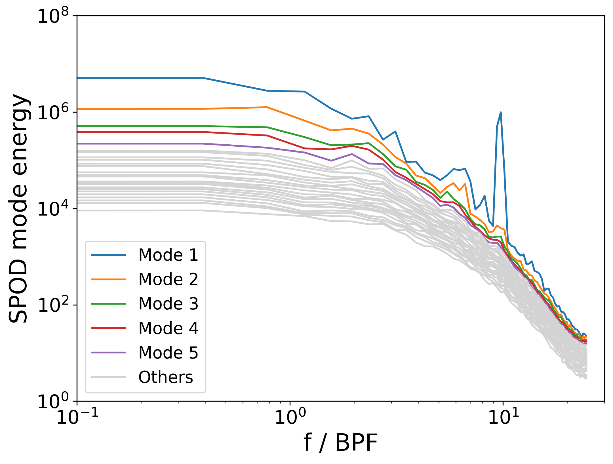
    <figcaption align="left"> SPOD mode energy spectrum </figcaption>

    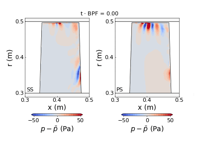
    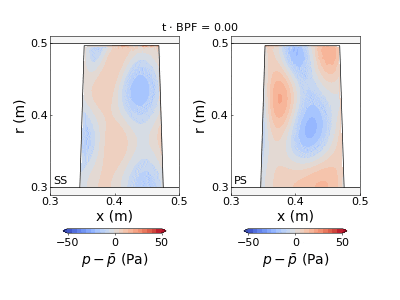
    <figcaption align="left"> (left): SPOD mode shape corresponding to tip leakage flow (Mode 1, 1.95 BPF); (right): SPOD mode shape corresponding to backward-travelling pressure wave (Mode 1, 9.77 BPF) </figcaption>

</figure>

---
### Case 4: 2D turbine film cooling
The 2D trailing edge cutback film cooling flow is feature by the mixing between the hot mainstream and the coolant in the trailing edge wake region. The data analyzed in this case is a 2D slice of the DDES data from Wang and Yan [[3](#ddes-cool)], and the working condition is at a Reynolds number of 6,200, a Strouhal number of 0.20 and a blowing ratio of 0.5. The figures below illustrate the flow schematics and the animation of the unsteady temperature field.

<figure>

    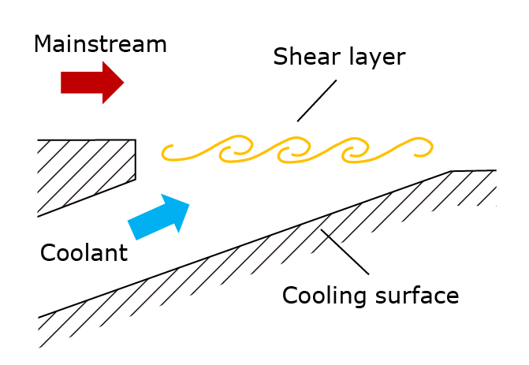
    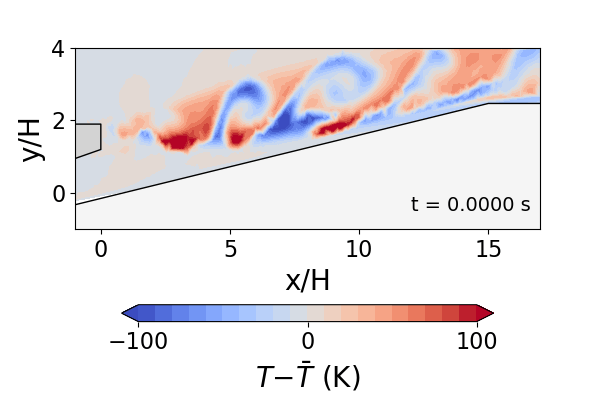
    <figcaption align="left"> (left): flow schematics; (right): animation of temperature fluctuation </figcaption>

</figure>

In the tutorial script *04_cooling_multi_var.py*, the following features of *spod_python* are demonstrated:
- multi-variable (i.e., density, u, v, T) SPOD in 'lowRAM' mode using user-defined parameters
- reconstruction of flow field using the frequency-domain method

The expected SPOD mode energy is illustrated in the figure below. An energy spike and its harmonics are captured by Mode 1 at the multiples of 2750 Hz. These spikes correspond to the vortex shedding, whose frequency is determined by the Strouhal number. The corresponding mode shapes of x-velocity and temperature are presented below.

<figure>

    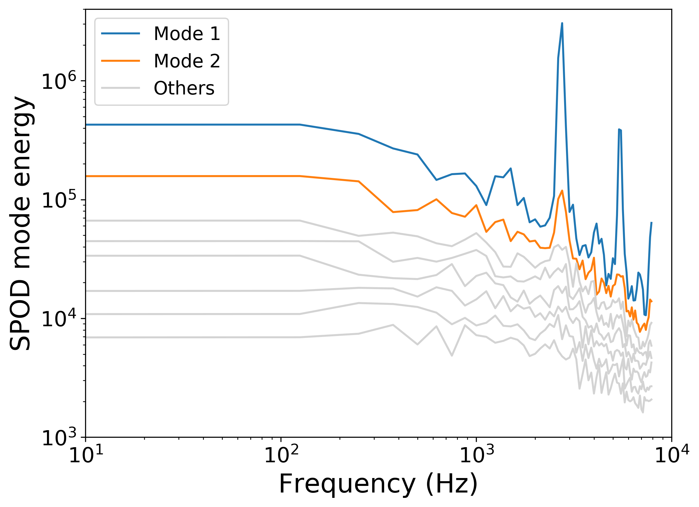
    <figcaption align="left"> SPOD mode energy spectrum </figcaption>

    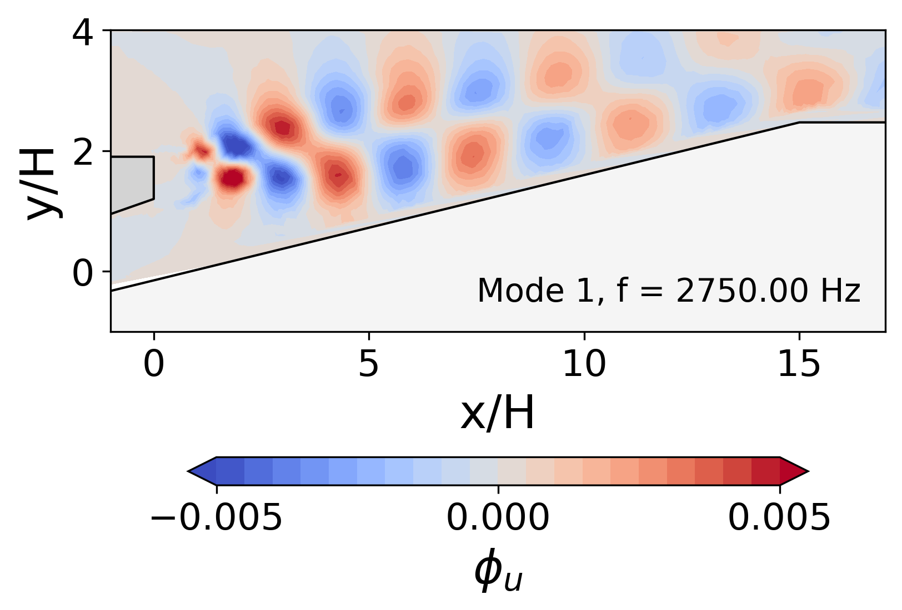
    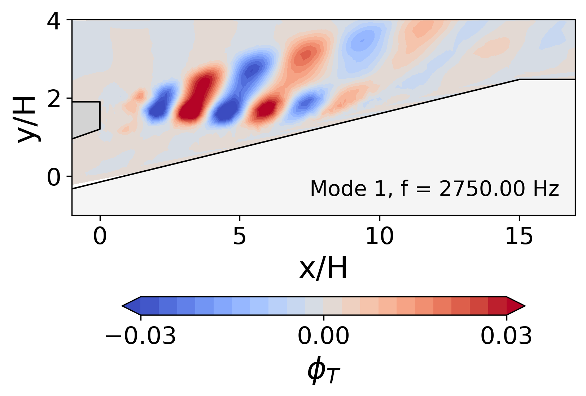
    <figcaption align="left"> (left): SPOD mode shape of x-velocity component; (right): SPOD mode shape of temperature </figcaption>

</figure>

---
## References
[<a id="jet">1</a>] Brès, G. A., Jordan, P., Jaunet, V., Le Rallic, M., Cavalieri, A. V., Towne, A., Lele, S., Colonius, T., & Schmidt, O. T. (2018). Importance of the nozzle-exit boundary-layer state in subsonic turbulent jets. Journal of Fluid Mechanics, 851, 83-124. [[DOI](https://doi.org/10.1017/jfm.2018.476)]

[<a id="ddes-comp">2</a>] He, X., Zhao, F., & Vahdati, M. (2022). Detached eddy simulation: recent development and application to compressor tip leakage flow. ASME Journal of Turbomachinery, 144(1), 011009. [[DOI](https://doi.org/10.1115/1.4052019)][[preprint](https://www.researchgate.net/publication/347355348_Detached_Eddy_Simulation_Recent_Development_and_Application_to_Compressor_Tip_Leakage_Flow)]

[<a id="ddes-cool">3</a>] Wang, R., & Yan, X. (2021). Delayed-detached eddy simulations of film cooling effect on trailing edge cutback with land extensions. ASME Journal of Engineering for Gas Turbines and Power, 143(11), 111004. [[DOI](https://doi.org/10.1115/1.4051865)]
